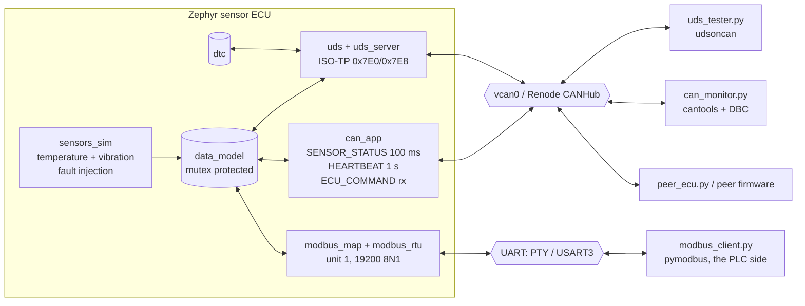

# Zephyr CAN + Modbus sensor ECU

[](https://github.com/daxrajani/zephyr-can-modbus-ecu/actions/workflows/ci.yml)

A Zephyr RTOS sensor node that speaks **CAN** (DBC-defined frames with E2E
protection, plus **UDS diagnostics over ISO-TP**) and **Modbus RTU**. It is
developed, tested and demonstrated entirely on emulated hardware:

* **`native_sim`**: the firmware as a Linux program, talking to a SocketCAN
  `vcan0` interface and a Modbus pseudo terminal. Fast iteration and most of
  the integration tests.
* **STM32F4 Discovery in [Renode](https://renode.io)**: the real ARM binary
  with an emulated bxCAN controller. It runs in a two-node CAN bench and is
  bridged to the host's `vcan0`, so the Python tools work against it unchanged.

Every push builds both targets and runs three test layers in GitHub Actions.



The key design point: **both buses front one data model**. A threshold
written over Modbus changes the alarm flag seen on CAN; a CAN command is
visible to the Modbus master; a UDS write shows up in both. The integration
tests in [`tests/integration/test_cross_bus.py`](tests/integration/test_cross_bus.py)
prove it on every commit.

## Bus contracts

All identifiers and registers are project defined. The DBC
([`dbc/sensor_ecu.dbc`](dbc/sensor_ecu.dbc)) is the source of truth for CAN,
and the integration tests decode live frames with it.

### CAN (500 kbit/s, 11-bit IDs)

| ID | Name | Direction | Period | Content |
|---|---|---|---|---|
| `0x100` | SENSOR_STATUS | ECU → bus | 100 ms | temperature (0.1 °C, signed), vibration RMS (0.01 mm/s), alarm, sensor fault, rolling counter, CRC-8 |
| `0x101` | HEARTBEAT | ECU → bus | 1000 ms | uptime (s), firmware state (INIT/RUN/DEGRADED), active DTC count |
| `0x200` | ECU_COMMAND | bus → ECU | on event | sample period, alarm threshold, fault injection, alarm reset, rolling counter, CRC-8 |
| `0x7E0` / `0x7E8` | UDS request / response | both | on request | ISO-TP framed diagnostics |

SENSOR_STATUS and ECU_COMMAND carry AUTOSAR-style E2E protection: a 4-bit
rolling counter in byte 6 and a CRC-8 SAE J1850 over bytes 0..6 in byte 7. The
ECU rejects commands with a bad CRC (and sets a DTC), a wrong DLC, or a
repeated counter (replay).

### UDS services (ISO 14229-1 over ISO 15765-2)

| SID | Service | Notes |
|---|---|---|
| `0x10` | DiagnosticSessionControl | default `0x01`, extended `0x03`; P2 = 50 ms, P2* = 5 s |
| `0x3E` | TesterPresent | keeps the extended session alive (S3 = 5 s); suppress bit supported |
| `0x22` | ReadDataByIdentifier | multiple DIDs per request; see table below |
| `0x2E` | WriteDataByIdentifier | `0x0103`, `0x0104`; extended session **and** security unlocked |
| `0x27` | SecurityAccess | level 1 seed/key, 3 attempts then 10 s lockout |
| `0x19` | ReadDTCInformation | sub-functions `0x01`, `0x02`, `0x0A` |
| `0x14` | ClearDiagnosticInformation | group `0xFFFFFF` |

| DID | Content | DID | Content |
|---|---|---|---|
| `0xF189` | firmware version (ASCII) | `0x0102` | status flags (alarm, sensor fault, fault injection) |
| `0xF18C` | serial number (ASCII) | `0x0103` | sample period, ms (R/W) |
| `0xF186` | active session | `0x0104` | alarm threshold, 0.1 °C (R/W) |
| `0x0100` | temperature, 0.1 °C | `0x0105` | uptime, s |
| `0x0101` | vibration RMS, 0.01 mm/s | | |

Negative responses: `0x11` service not supported, `0x12` sub-function not
supported, `0x13` incorrect length, `0x14` response too long, `0x24` request
sequence error, `0x31` request out of range, `0x33` security access denied,
`0x35` invalid key, `0x36` exceeded attempts, `0x37` time delay not expired,
`0x7F` service not supported in active session.

DTCs (status bits testFailed, testFailedThisOperationCycle, pending, confirmed):

| DTC | Meaning |
|---|---|
| `0x0A1011` (P0A10-11) | temperature sensor out of range (−40.0 … 125.0 °C) |
| `0xC07388` (U0073-88) | CAN bus off (stays confirmed after recovery) |
| `0xC10087` (U0100-87) | Modbus master silent for more than 5 s after it had been polling |
| `0xC41481` (U0414-81) | ECU_COMMAND received with a bad CRC |

The seed/key algorithm is a deliberately simple public demo, not a security
mechanism. A real ECU would keep the key derivation in an HSM.

### Modbus RTU (unit 1, 19200 baud, 8N1)

| Address | Type | Content | Access |
|---|---|---|---|
| 30001 | input register | temperature × 10 (int16) | R |
| 30002 | input register | vibration RMS, 0.01 mm/s | R |
| 30003–30004 | input registers | uptime, s (32-bit, high word first) | R |
| 30005 | input register | active DTC count | R |
| 10001 | discrete input | alarm active | R |
| 10002 | discrete input | sensor fault | R |
| 40001 | holding register | sample period, ms (10…10000) | R/W |
| 40002 | holding register | alarm threshold × 10 (int16, −400…1250) | R/W |
| 00001 | coil | alarm reset (write 1; reads 0) | W |
| 00002 | coil | fault injection | R/W |

The alarm **latches**. Crossing the threshold sets it, and only an alarm reset
(coil 00001, or ECU_COMMAND bit) clears it, and then only once the
temperature is back at or below the threshold.

## Repository layout

```
app/                  Zephyr application (both targets)
  src/                data_model, sensors_sim, can_codec, can_app, uds, uds_server,
                      dtc, modbus_map, modbus_rtu, modbus_server, crc
  boards/             native_sim_native_64 and stm32f4_disco overlays
peer/                 second Zephyr node for the two-machine Renode bench
dbc/sensor_ecu.dbc    CAN database
host/                 uds_tester.py, modbus_client.py, can_monitor.py, peer_ecu.py
tests/unit/           Ztest suites, run with twister
tests/integration/    pytest on vcan0 + PTY (native_sim, and the Renode bridge)
renode/               ecu.resc (two-node CANHub), ecu_bridge.resc (vcan0 bridge),
                      ecu.robot, STMCAN_Zephyr.cs (fixed bxCAN model)
scripts/setup_vcan.sh
docs/                 architecture notes and debugging findings
west.yml              pins Zephyr v4.4.2
```

## Getting started

Requirements: Linux (Ubuntu 24.04 tested) with the Zephyr SDK, `can-utils`
and the `vcan` module. **WSL2's stock kernel has no `vcan`**, so on WSL2 the
CAN tests skip locally and run in CI. Everything else, including Renode,
works there.

```bash
# Workspace (once)
mkdir ecu-ws && cd ecu-ws
git clone https://github.com/daxrajani/zephyr-can-modbus-ecu
west init -l zephyr-can-modbus-ecu && west update
west packages pip --install
cd zephyr-can-modbus-ecu
pip install -r host/requirements.txt

# Build
west build -b native_sim/native/64 app -d build/native
west build -b stm32f4_disco app -d build/stm32
west build -b stm32f4_disco peer -d build/peer

# Run on native_sim
scripts/setup_vcan.sh                       # creates vcan0
build/native/zephyr/zephyr.exe              # prints the Modbus pty, e.g. /dev/pts/3
python host/can_monitor.py                  # live DBC decode + E2E check
python host/uds_tester.py info              # version, serial, live values
python host/uds_tester.py write-threshold 27.5
python host/modbus_client.py /dev/pts/3 poll
python host/peer_ecu.py --threshold 27.5    # supervisory second node
```

### Tests

```bash
west twister -T tests/unit -p native_sim/native/64        # Ztest unit tests
python -m pytest tests/integration -v                    # needs vcan0 for the CAN/UDS parts
RENODE=/path/to/renode python -m pytest tests/integration/test_renode_bridge.py
/path/to/renode-test renode/ecu.robot                    # two-node Renode bench
```

### Renode by hand

```text
(monitor) include @renode/ecu.resc          # ECU + peer node on a CANHub
(monitor) start
(monitor) include @renode/ecu_bridge.resc   # or: ECU bridged to the host's vcan0
```

## Testing and CI

| Layer | Tool | Runs on | What it checks |
|---|---|---|---|
| Unit | Ztest + twister | native_sim | CRC-8/CRC-16 check values, CAN layouts vs the DBC, alarm latching, register map bounds, DTC status bits, every UDS service and NRC, S3, security lockout |
| Integration | pytest + python-can + cantools + udsoncan + pymodbus | native_sim on `vcan0` + PTY | frame periods, DBC decode, E2E rejection (CRC, DLC, replay), command latency, UDS sessions/security/DTC lifecycle, Modbus map and exceptions, cross-bus behaviour, master-timeout DTC |
| Integration | same tools | STM32F4 binary in Renode, bridged to `vcan0` | the ARM build's frames decode on the host and it answers the UDS tester |
| Emulated target | Robot Framework (`renode-test`) | two STM32F4 machines on a CANHub | boot, heartbeat, E2E sensor frames, multi-frame UDS, two-node command exchange, no faults |

CI ([`.github/workflows/ci.yml`](.github/workflows/ci.yml)) builds all
three images, runs every layer and uploads the twister/pytest/Robot reports,
a `candump` capture of the integration run, and the measurements
(`metrics.json`: frame period statistics, command latency, Modbus response
time) as artifacts.

## Measured results

From CI run [36814140120](https://github.com/daxrajani/zephyr-can-modbus-ecu/actions/runs/36814140120)
(GitHub-hosted `ubuntu-24.04`, `native_sim` on `vcan0`; see `metrics.json` in
the `test-results` artifact):

| Metric | Result |
|---|---|
| Tests per commit | **107**: 63 Ztest unit, 37 pytest integration (including 2 against the ARM binary over the Renode bridge), 7 Robot Framework on Renode |
| SENSOR_STATUS period (target 100 ms, 51 frames) | mean 100.001 ms, σ 0.029 ms, worst deviation 0.094 ms |
| HEARTBEAT period (target 1000 ms) | mean 999.997 ms, σ 0.029 ms |
| ECU_COMMAND to SENSOR_STATUS showing it (10 cycles) | mean 94.7 ms, max 100.1 ms (bounded by the 100 ms frame cycle) |
| Modbus RTU read of 5 input registers (50 transactions) | mean 20.0 ms, p95 21.8 ms, includes the 5 ms PTY frame gap |
| Image size, STM32F4 | 62 KB flash, 20 KB RAM |

These are scheduling numbers on a Linux host, not bus measurements (see
Limitations).

## Findings worth knowing

Two problems that only showed up because the project runs on more than one
target. Details are in [`docs/findings.md`](docs/findings.md).

1. **ISO-TP filter overlap on hardware-filtering CAN controllers.** A Zephyr
   ISO-TP server listens for requests on `0x7E0`, and while it sends a
   multi-frame response its send context adds a *second* `0x7E0` filter for
   the tester's flow control. SocketCAN delivers a frame to every matching
   filter, so native_sim works. bxCAN and M_CAN dispatch by filter match
   index to exactly one, so the flow control can land in the request context
   and the response stalls. The server releases its request binding for the
   duration of a multi-frame response (UDS is half duplex).
2. **Renode's STM32 bxCAN model needed six fixes** to run Zephyr's driver:
   init mode while asleep, filter match index never reported, the second
   16-bit filter in a bank ignored, 16-bit id/mask halves swapped, inverted
   filter priority, and transmissions that complete inside the register write.
   They are fixed in [`renode/STMCAN_Zephyr.cs`](renode/STMCAN_Zephyr.cs),
   a patched copy of the upstream MIT-licensed model that Renode compiles at
   load time.

## Limitations, stated plainly

* **Simulation is not real timing.** Bus load, bit timing, arbitration and
  electrical faults are not modelled. Frame-period numbers come from a Linux
  host scheduling `native_sim`. They show the firmware's scheduling is right,
  not what a transceiver would measure.
* The STM32 build uses **CAN1** (PD0/PD1) rather than the board's default
  CAN2: for the CAN2 slave, the Renode model numbers filters across all 28
  shared banks instead of from `CAN2SB`.
* Zephyr's Modbus server maps every register-callback error to exception
  `0x02` (illegal data address), including out-of-range values that a strict
  server would answer with `0x03`.
* Modbus RTU framing is done in the application on top of Zephyr's raw ADU
  interface, because the `native_sim` PTY UART has no `uart_configure()`,
  which Zephyr's built-in RTU backend requires. The same framer runs on the
  STM32.
* DTCs live in RAM. NVS/ZMS persistence is the next step on hardware.

## Moving to real hardware

The STM32F4 build is the real-hardware build: add a CAN transceiver on
PD0/PD1 and an RS-485 transceiver on USART3 (PD8/PD9). For another board, add
an overlay that sets `zephyr,canbus` and `ecu,modbus-uart`. An MCP2515 SPI
CAN controller works the same way through Zephyr's `microchip,mcp2515`
driver, with no application changes.

## License

Apache-2.0, except [`renode/STMCAN_Zephyr.cs`](renode/STMCAN_Zephyr.cs),
which is derived from Renode (MIT, © Antmicro) and keeps its license header.
