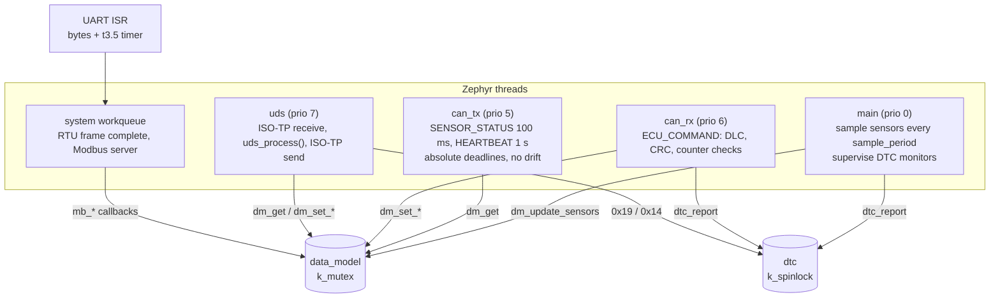

# Architecture

## One data model, three front ends



* **Every** access to the shared state goes through `data_model.c`, under one
  `k_mutex`. `dm_get()` returns a consistent snapshot, so the CAN transmitter
  never sends a temperature from one sample with an alarm flag from another.
* Validation lives in the model (`dm_set_*` return `-EINVAL`), so CAN, UDS and
  Modbus cannot disagree about ranges. Each front end only maps the error to
  its own protocol: a log line and a DTC for CAN, NRC `0x31` for UDS, an
  exception response for Modbus.
* The alarm is evaluated inside the lock whenever a sensor value **or** the
  threshold changes, so a threshold written on one bus is visible on the
  other in the very next frame (tested by `test_cross_bus.py`).
* The DTC store is a small array guarded by a spinlock. Reports are tiny and
  can come from any thread.

## Pure logic vs Zephyr glue

| Hardware independent (unit tested) | Zephyr glue (integration / Renode tested) |
|---|---|
| `crc.c` CRC-8 SAE J1850, CRC-16 Modbus | `can_app.c` CAN threads, filters, bus-off monitor |
| `can_codec.c` frame layouts | `uds_server.c` ISO-TP binding and the multi-frame rule |
| `data_model.c` state, ranges, latching alarm | `modbus_rtu.c` UART ISR framing, raw ADU bridge |
| `dtc.c` ISO 14229 status bits | `modbus_server.c` server setup |
| `uds.c` all services, NRCs, S3, security | `main.c` start-up and supervision loop |
| `modbus_map.c` register map, master timeout | |
| `sensors_sim.c` deterministic synthetic signals | |

`uds_process()` takes a request buffer and a timestamp and returns the
response, with no transport inside. That lets 27 Ztest cases cover every UDS
path without a CAN bus.

## Devicetree contract

The application needs two `chosen` nodes, so a new board is one overlay:

```dts
/ {
    chosen {
        zephyr,canbus = &can1;        /* any Zephyr CAN controller */
        ecu,modbus-uart = &usart3;    /* any UART with the interrupt API */
    };
};
```
